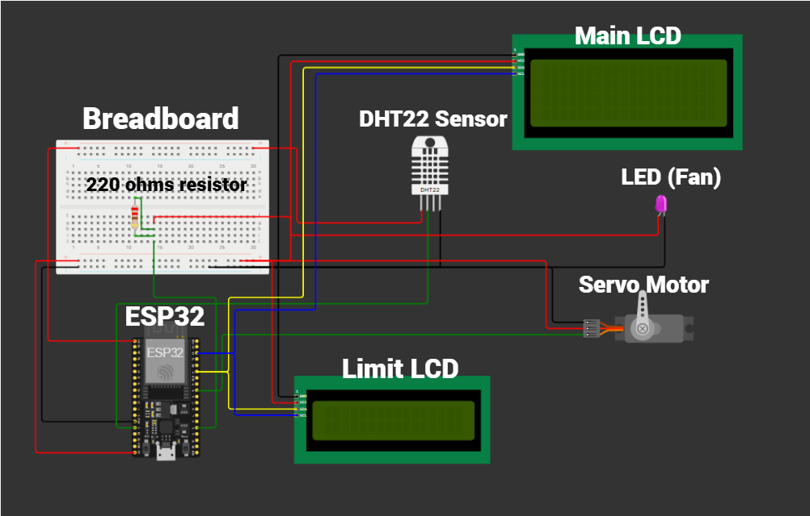
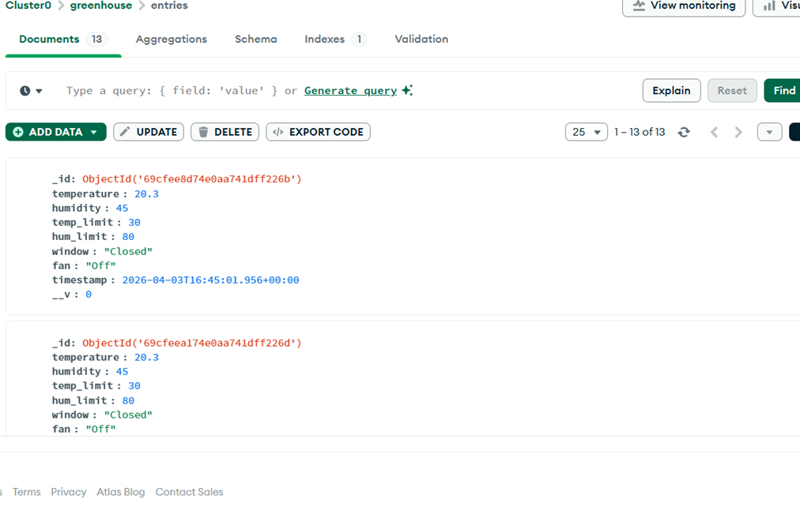
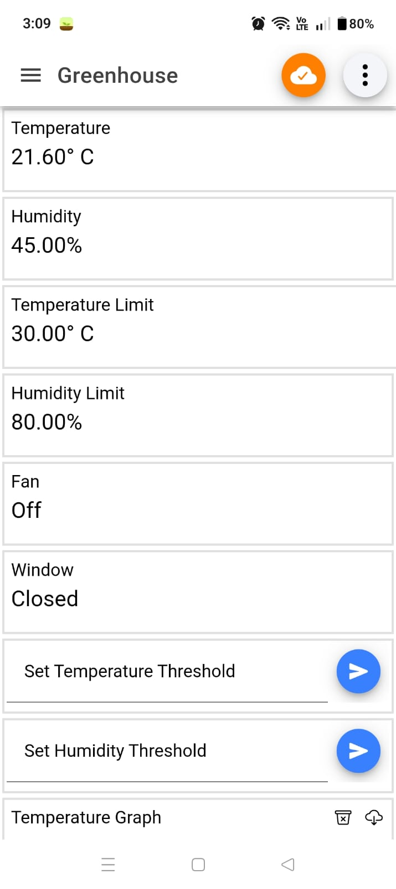
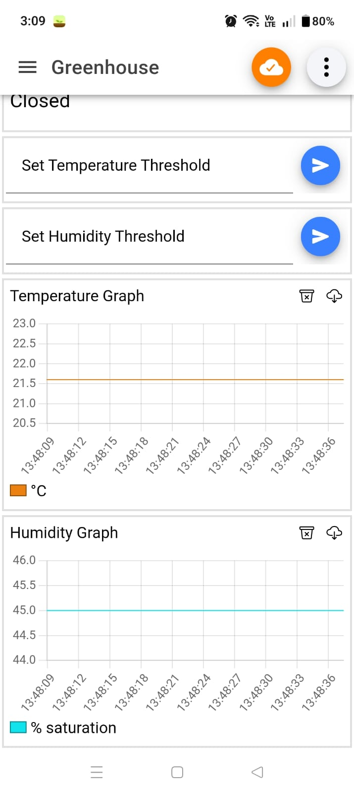
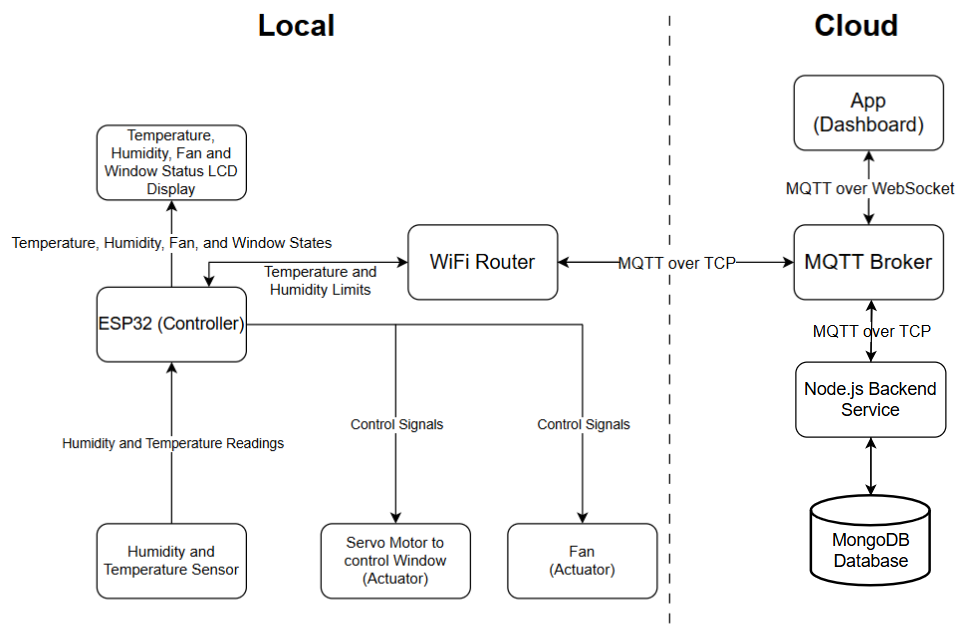
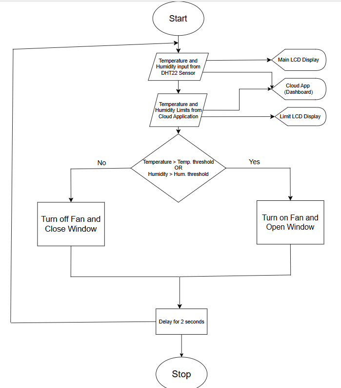
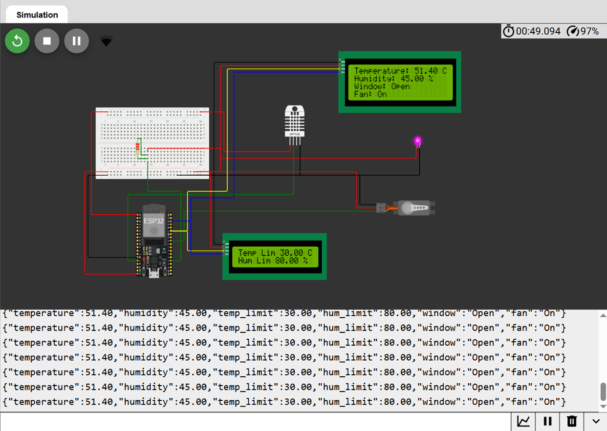

# Smart Greenhouse Monitoring and Automation System

## Overview

An IoT-based smart greenhouse system designed for real-time environmental monitoring and automated control using ESP32 devices, MQTT communication, a Node.js backend, and MongoDB storage.

The system collects environmental data, temperature and humidity, from ESP32 sensor nodes simulated using Wokwi. Sensor data is transmitted from the ESP32 device via MQTT using HiveMQ Cloud as the message broker. The backend server subscribes to relevant MQTT topics, processes incoming data, stores it in MongoDB, and exposes APIs for a monitoring dashboard to visualize real-time and historical greenhouse data.

It performs automated ventilation and allows the user to remotely configure the environmental thresholds through the app (dashboard).

---

## Features

- Real-time environmental monitoring
- ESP32 sensor simulation using Wokwi
- MQTT-based communication
- Node.js + Express backend
- MongoDB data storage
- REST API integration
- Dashboard/mobile monitoring interface
- Automated greenhouse control logic

---

## Tech Stack

### Hardware / IoT
| Sl. No. | Component                | Type               | Role |
|--------|--------------------------|--------------------|------|
| 1      | ESP32                    | Processing Unit    | Microcontroller that processes sensor data and controls actuators/LCDs |
| 2      | DHT22 Sensor             | Sensor             | Measures temperature and humidity |
| 3      | Servo Motor              | Actuator           | Opens/closes the greenhouse window |
| 4      | Fan (represented by LED) | Actuator           | Provides ventilation inside the greenhouse |
| 5      | 20x4 LCD Display (Main)  | Output Device      | Shows current temperature, humidity, window, and fan states |
| 6      | 16x2 LCD Display (Limit) | Output Device      | Displays user-set temperature and humidity limits |
| 7      | Breadboard               | Connector Platform | Provides easy wiring and connections between components |
| 8      | Resistor                 | Passive Component  | Limits current to protect LED |
| 9      | Power Supply             | Power Source       | Provides required voltage/current to ESP32, actuators, and sensors |

## Circuit Diagram

### Backend
- Node.js
- Express.js
- MQTT (HiveMQ broker)
- MongoDB
- Mongoose

## MongoDB Collection

### Frontend (Dashboard)

### Communication
Between the ESP32 and MQTT broker:  (MQTT over TCP with TLS, encrypted)
ESP32 is connected to WOKWI virtual Wi-Fi router
ESP32 publishes sensor data (json string) to broker with topic greenhouse/sensor1
ESP32 is subscribed to topics greenhouse/control/temp_limit and greenhouse/control/humidity_limit

Between the MQTT broker and the Mobile App client: (MQTT over WebSocket with TLS)
App is subscribed to topic greenhouse/sensor1 (receives json string)
App publishes user-defined limits (string) to broker with topics greenhouse/control/temp_limit and greenhouse/control/humidity_limit
WSS (WebSocket Secure) runs on top of TCP and provides a persistent bidirectional connection, over which mqtt messages are transmitted.

---

## System Architecture

ESP32 Sensors
      ↓
 MQTT Broker
      ↓
 Node.js Backend
      ↓
   MongoDB
      ↓
 Dashboard / Mobile App

## Flowchart

## Simulation Output

